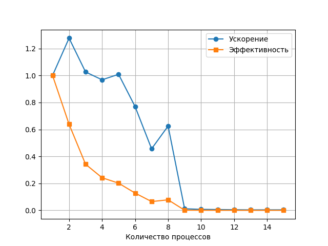
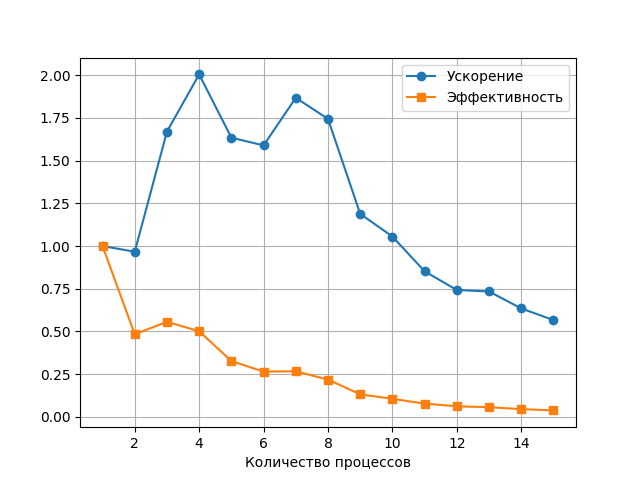
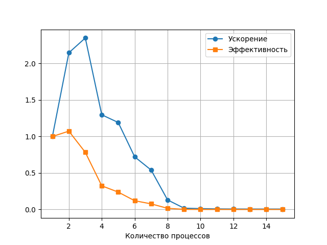
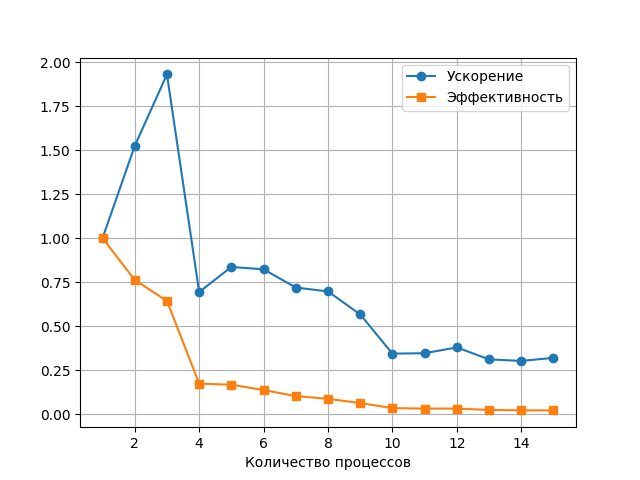

# Параллельная реализация игры "Жизнь" с использованием MPI

## Описание проекта
Реализация параллельного клеточного автомата "Игра Жизнь" с использованием библиотеки `mpi4py` для распараллеливания вычислений. Проект включает:
- Загрузку начальной конфигурации из файла
- Параллельное выполнение шагов эволюции
- Сохранение результата в файл
- Измерение производительности

## Требования
- Python 3.7+
- Установленная реализация MPI:
  - **Windows**: MS-MPI
  - **Linux**: OpenMPI/MPICH
  - **macOS**: OpenMPI
- Библиотеки Python:
  ```bash
  pip install mpi4py numpy 
  ```
## Установка
### Для Windows: 
1. Скачайте MS-MPI с официального сайта
2. Установите оба пакета: msmpisetup.exe и msmpisdk.msi
### Для macOS:
```bash
brew install open-mpi
```
### Для Linux:
```bash
sudo apt-get install openmpi-bin libopenmpi-dev 
```
## Запуск программы
```bash
mpiexec -n <количество_процессов> python Life_mpi.py <входной_файл> <шаги> <выходной_файл> 
```
## Параметры:
- <количество_процессов>: число процессов MPI (1, 2, 4 и т.д.)
- <входной_файл>: текстовый файл с начальной конфигурацией
- <шаги>: количество итераций эволюции
- <выходной_файл>: файл для сохранения результата
### Пример:
```bash
mpiexec -n 4 python Life_mpi.py input.txt 100 output.txt
```
### Пример (глайдер):
```text
0000000
0010000
0001000
0111000
0000000
```
## Визуализация
Для отображения результатов используйте:

```bash
python View_fronted_grid.py output.txt
```
Скрипт покажет состояние в консоли, используя:
- '#' - живые клетки
- '.' - мертвые клетки
### Пример:
```text
#.###.###.
####.#...#
.#........
##...#.###
##.....#..
#.#.#..###
#####..#..
..#.#...#.
#.#.##.#..
.........#
```
## Генерация тестовых данных
```bash
python Generate_grid.py <ширина> <высота> <выходной_файл>
```
### Пример:
```bash
python Generate_grid.py 50 50 random_input.txt
```
## Структура проекта
```text

├── Life_mpi.py             # Основная программа
├── View_stats.py           # Визуализация результатов
├── View_fronted_grid.py    # Визуализация grid
├── Generate_grid.py        # Генератор случайных полей
├── input.txt               # Пример входных данных
├── requirements.txt        # Зависимости
└── README.md               # Документация
```
## Примеры вычислений
- 100x100 с шагом 100 ("Малое число шагов, маленькая карта"):

- 1000x1000 с шагом 100 ("Малое число шагов, большая карта")
- 
- 100x100 с шагом 1000 ("Большое число шагов, маленькая карта")
- 
- 1000x1000 с шагом 1000 ("Большое число шагов, большая карта")
- 

## Пояснения по результатам:

На графиках ускорения видно, что при увеличении числа процессов (потоков) ускорение растёт нелинейно. В некоторых случаях даже наблюдается ухудшение (например, на маленькой карте или при малом числе шагов), поскольку накладные расходы на синхронизацию и коммуникацию между процессами начинают доминировать.

Эффективность (ускорение, делённое на число процессов) падает с увеличением числа процессов, так как затраты на синхронизацию (обмен граничными строками) становятся ощутимыми. Особенно это заметно при небольшом объёме вычислений – при большом размере поля и большом числе шагов эффективность выше, так как вычислительная нагрузка долго окупает синхронизацию.
