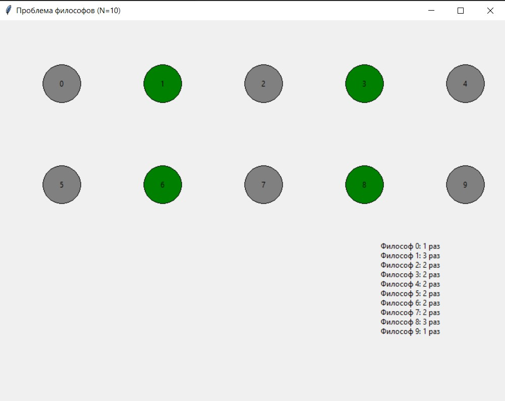

# Проблема обедающих философов

Визуализация классической задачи синхронизации с использованием алгоритма Чанда-Мисра.

## Описание

Программа моделирует проблему обедающих философов, где несколько потоков (философов) конкурируют за ограниченные ресурсы (вилки) с использованием алгоритма Чанда-Мисра для предотвращения взаимоблокировок.

## Особенности

- Графическая визуализация состояния философов
- Реализация алгоритма Чанда-Мисра
- Статистика по количеству приемов пищи
- Корректная обработка завершения программы
- Настраиваемое количество философов

## Требования

- Python 3.7+
- Библиотека tkinter, threading (обычно входят в стандартные библиотеки Python)

## Алгоритм Чанда-Мисра

- Алгоритм решает проблему взаимоблокировок (deadlock) с помощью асимметричного подхода:
- Четные философы (ID 0, 2, 4...) берут вилки в порядке: левая → правая
- Нечетные философы (ID 1, 3, 5...) берут вилки в порядке: правая → левая

### Такой подход гарантирует:

- Отсутствие взаимоблокировок
- Справедливость (никто не останется голодным)
- Эффективное использование ресурсов

## Интерфейс
Философы отображаются цветными кругами:

- 🟢 Зеленый - ест
- ⚪ Серый - размышляет
- В правом нижнем углу отображается статистика по количеству приемов пищи

